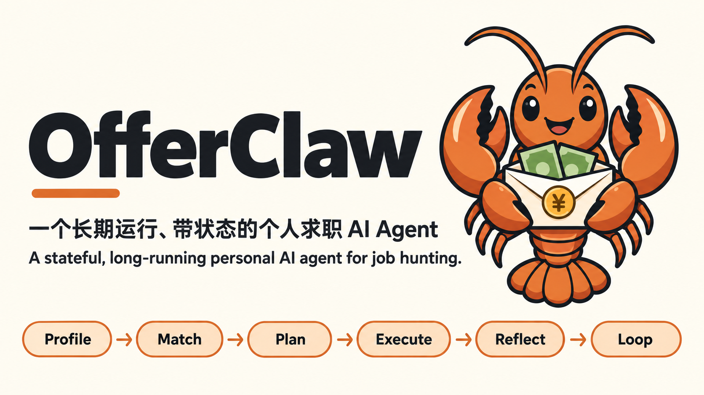

<p align="center">
  
</p>

<h1 align="center">OfferClaw</h1>

<p align="center">
  <strong>一个长期运行、带状态的个人求职 AI Agent</strong><br>
  <em>A stateful, long-running personal AI agent for job hunting.</em>
</p>

<p align="center">
  画像 → 匹配 → 规划 → 执行 → 复盘 → 回到画像<br>
  <sub>Profile · Match · Plan · Execute · Reflect · Loop</sub>
</p>

<p align="center">
  
  
  
  
  
  
</p>

<p align="center">
  
  
  
  
  
  
</p>

<p align="center">
  <strong>把"找工作"当成持续运行的工程项目。</strong><br>
  <sub>个人作品集 · 不自动投递 · 不伪造经历 · 不预测录用概率</sub>
</p>

---

## 项目数据

<table align="center">
<tr>
  <td align="center"><strong>1,659</strong><br><sub>测试通过</sub></td>
  <td align="center"><strong>91</strong><br><sub>FastAPI 路由</sub></td>
  <td align="center"><strong>89%</strong><br><sub>RAG R@1</sub></td>
  <td align="center"><strong>3327</strong><br><sub>RAG chunks</sub></td>
  <td align="center"><strong>14</strong><br><sub>LangGraph 节点（4 实验 RAG + 10 CareerFlow）</sub></td>
  <td align="center"><strong>3</strong><br><sub>多 Persona 回归</sub></td>
</tr>
</table>

---

## Why OfferClaw

> 求职过程通常被拆成"刷岗位 → 改简历 → 投 → 等"这种一次性动作。

这种方式的问题是：

- 简历和 JD 之间的**真实差距**没人告诉你，匹配靠感觉
- 学习计划和投递节奏**互相脱节**，今天该做什么靠记忆
- 每次投递、每次面试反馈**没有沉淀**，画像不更新
- 生成式工具能写漂亮文案，但**没有状态、没有约束、没有可解释性**

OfferClaw 的思路：用一个**带状态**的 Agent 把链路连起来——所有判断走 **Prompt 契约 + 规则代码双通路**，所有状态写入可读的 **Markdown 文件**，所有变更经同一个 **Orchestrator** 反向修正画像与计划。

---

## 核心能力

| 能力 | 说明 |
|---|---|
| **画像渐进收集** | 13 字段用户画像，按需 Onboarding，每次复盘自动回写更新 |
| **JD 匹配 + 缺口** | 输入一段 JD，输出结构化能力差距清单（带致命度 / 短期可补性元数据） |
| **学习路线规划** | 基于缺口生成 4 周路线，按周→按日两层任务展开；打开页面按当天切出**今日计划**，可直接修改并双向同步回整体计划（同一份文件，无副本漂移） |
| **每日执行 + 复盘** | 每日计划 / 实际 / 偏离度判断，复盘结果回写画像 |
| **简历 Review 工作流** | 简历工坊用一个入口生成项目经历或完整简历；Resume Agent 写作，硬规则与独立 Critic 审查，必要时修订，用户批准后才保存 |
| **JD 半自动抽取** | 粘贴招聘页 URL，自动抓取（含 Playwright SPA 兜底）并用于当次分析；确认投递后绑定为正式 JD 版本 |
| **今日建议** | 打开页面即看到"今天最该做什么"——由 Orchestrator 跨模块综合判断 |
| **本地 RAG 问答** | 顶部问答条直接查询全部 Prompt 契约 / 画像 / 投递记录 / 复盘日志 |
| **知识库两轨审核入库** | 途径A：md 直投 `knowledge_base/` 子目录 → UI「未入库」扫描；途径B：URL 抓取 / 上传 md·txt·pdf·docx（**引擎自动路由**：PDF→Docling 结构化·公式 LaTeX·图片 qwen-vl 识别,失败回退文字层；docx→原生解析）→ 打分落候选。两轨都经 **UI 卡内预览审核**后增量入库；使用指南见 [`knowledge_base/README.md`](knowledge_base/README.md) |
| **CareerFlow 编排** | LangGraph 10 个业务节点串起完整求职流；条件路由按结论分流（UI 折叠成 8 个可见阶段） |
| **ReAct Agent** | 一句自然语言驱动 6 个 OpenAI 兼容 Tool，无 KEY 也能跑 |
| **MCP Server** | Streamable HTTP 传输（POST /mcp），REGISTRY 全部工具暴露给 Claude Code 等任意 MCP 客户端 |
| **Trace 重放** | 每次 CareerFlow 落成 JSONL trace，可重放、可审计 |

---

## ⚙️ 工程亮点 · Engineering Highlights

> 不只是「功能能跑」，而是把 RAG 检索与 LLM/Agent 调用都做到了**生产级工程化**——每项改进都有量化指标、故障注入测试、逐轮可追溯日志。完整记录见 [`docs/RAG_OPTIMIZATION_LOG.md`](docs/RAG_OPTIMIZATION_LOG.md) 与 [`docs/AGENT_OPTIMIZATION_LOG.md`](docs/AGENT_OPTIMIZATION_LOG.md)。

### RAG 检索系统 · 评测驱动迭代

生产 `/api/query` 使用显式检索管线，而不是由 `rag_graph.py` 统一编排：路由与作用域 → 原问题 + HyDE 双通道 → Dense/BM25/RRF → bge-reranker → answerability v5 判据重排 → 三票共识证据门。`rag_graph.py` 保留为 LangGraph RAG 实验/演示实现；生产链路集中在 `rag_api.py` 与 `rag_gate.py`，便于逐阶段回退和审计。

| 环节 | 当前设计 | 可核验证据 |
|------|---------|-----------|
| 候选形成 | 原问题与 HyDE 各走 Dense/BM25，RRF 融合；距离统一重算回原问题 | Final v4 Candidate **69/80→73/80** |
| 排序 | bge-reranker 提供话题相关性；LLM 判据按“片段是否含答案”分档后再排序 | Final v4 R@3 **68/80→70/80**，R@5 **69/80→72/80** |
| 证据门 | 三态关系 + 三票共识；故障票按拒答处理，判据不可用时不改原排序 | 有效作答 **29/80→59/80**；历史 Final v4 的门控 `correct_premise` **8/12→12/12** |
| 回退与谱系 | 提示词、索引、配置留哈希；answerability / gate / HyDE 均有独立回退旋钮 | pytest、冻结包与 pre-push 回归门禁 |

**三套评测口径诚实并列：**

| 评测集 | R@1 | R@3 | R@5 | MRR | 限定 |
|---|---:|---:|---:|---:|---|
| 同分布文件级（n=100） | **89.0%** | **95.0%** | **97.0%** | **0.9195** | 问题与文档标题近义偏多，是偏乐观上限 |
| 口语化回归集（n=52） | **75.0%** | **80.8%** | **84.6%** | **0.7875** | 首列为 Recall@1；最初为 held-out，但已参与多轮开发，不再称盲集 |
| Final v4 strict chunk（80 正例） | **59/80** | **70/80** | **72/80** | **0.8083** | 历史冻结盲测，三跑逐指标中位；nDCG@5 **0.8317** |

Final v4 上 Quality 的 **R@1 没有提高**（A/C 均为 59/80）；主要收益是 Candidate、Top-K、有效作答和门控动作。代价是须拒答子集出现 **1/28 真误纳**，以及完整 Quality 检索在历史同分布 100 题冷缓存下 p50 **13.9s**、p95 **29.8s**。当前拒答守卫为简单负例 **12/12**、近似负例 **11/12**。

- **跨语言显式论文检索**：xling50 grounded 正确 **30/50（60%）**、错误放行 **0**、p50/p95 **309/589ms**；仅在显式 `paper_kb` 路由生效，不能外推到普通查询。
- **HyDE 取舍**：替换式 HyDE 会污染按原问题标定的距离分布，因此被否决；当前采用附加式双通道，并把候选距离统一重算回原问题。
- **答案质量（当前 HEAD）**：冻结的历史开发回归集 n=48（40 正例 + 8 负例，非盲集/非 organic），两个独立裁判配置对同一不可变答案完成 **96/96** 裁判。正例 claim 忠实度 **96.9%–97.1%**，答案要求完整度 **65.0%–81.3%**，有效完整度 **63.8%–81.3%**；39/40 进入 KB grounded，28/40 命中冻结 exact-gold chunk。8 个负例的 pipeline 路由动作本身 **8/8**，但端到端动作合同仅 **6/8**；其中 4 个 `correct_premise` 最终答案只有 **2/4** 真正纠错，说明门控动作尚未完全传给生成合同。原始裁判输出属于本地私有评估包，不进入 Git。
- **当前答案链延迟**：同一 n=48、独立空判据缓存、模型常驻单进程下，检索 p50/p95 **31.0s/80.4s**，生成 **4.35s/77.4s**，端到端 **37.6s/97.1s**。这是当前最明确的工程短板，不与历史 Final v4 的纯检索延迟混写。
- **小型产品验收**：画像治理、JD 匹配、今日计划、投递生命周期、复盘记忆、简历/CareerFlow 六域共 **36/36** 通过（各域 6 例，含跨模块不变量：审批治理、非法状态拒绝、损坏恢复、并发写、节点降级、重放幂等）；全部复用 `tmp_path` 隔离合同，不调用外部 LLM、不写真实用户状态。
- **回归防线**：`eval_rag_bench.py --fail-under` 已落地为 `.githooks/pre-push`；改检索代码会触发离线回归，不把外部 LLM 可用性当成 push 的硬依赖。

### LLM/Agent 工程化 · 12 项容错加固 + CI

把检索侧的弹性容错**系统复刻到生成/编排/记忆/工具/数据全栈**，用故障注入测试量化：

| 层 | 加固 | 从 → 到 |
|----|------|---------|
| LLM 调用 | 统一网关（重试+退避+降级+**额度兜底自动切换**）+ choices 防御 | 代理抖动崩 CLI → 重试后成功、可读降级；主模型额度耗尽 → 自动切兜底模型 |
| 编排 | DAG 节点 fail-soft（`node_guard`）| 一处炸=整图崩 → 单节点降级 |
| 工具 | 装配防御 + 墙钟预算 + schema 漂移校验 | 畸形/卡死/漂移即崩 → 降级 + 超时 + CI 拦截 |
| 记忆 | 原子写 + 损坏可恢复 + 并发锁 | 损坏静默吞 → 失败可见 + 沉淀不丢 |
| 数据/CI | 状态原子写 + 评测门禁 | 半截损坏 + 手动跑 → 原子化 + 提交即拦截 |

**47 个专项故障注入测试 + 1,659 全量测试通过 + CI 门禁**（`.github/workflows/ci.yml`）。

### 多 Agent 架构 · Supervisor 编排(2026-07)

- **内环专家 Agent**:学习规划 / 简历定制 / 独立校验各司其职,按匹配三档结论条件路由;JD Parser 与语义证据对齐器是受约束服务，**匹配裁决坚持规则引擎**（LLM 只关联已有证据，不碰硬门槛和最终三档）
- **生成-校验分离**:简历由生成 Agent 产出、独立校验 Agent 对照画像与 metrics 真值核对,守"不编造"硬边界(编造硬拦=代码,LLM 仅语义标注)
- **外环督导**(确定性代码):跨天记忆沉淀、停滞检测、多 JD 并行编排
- **Agentic-RAG**：可选 CRAG 条件恢复循环（证据弱时改写重检；`RAG_CRAG=0` 默认关），只在口语化回归集测正后才考虑晋级；生产默认门为 answerability v5 + 三票共识
- 泛化与诚实数据:职业域泛化 **31 项兼容测试** + 跨域泛化矩阵 **128 对**(合成画像,明标)
- 设计权衡、reframe/新增台账与"测正才采纳"纪律 → [`docs/MULTI_AGENT_UPGRADE.md`](docs/MULTI_AGENT_UPGRADE.md)

---

## How It Works

```
                       用户输入一段 JD
                              │
                              ▼
                  ┌──────────────────────┐
                  │   profile_loader     │  读 user_profile.md
                  │   13 字段画像 + 缓存   │  按 JSON Schema 校验
                  └──────────┬───────────┘
                             │
                             ▼
              ┌────────────────────────────┐
              │  CareerFlow (LangGraph)    │  routed: 条件路由 4 分支
              │  profile → job_input →     │
              │  match → gap → plan →      │
              │  today → resume →          │
              │  application_suggest       │
              └──────────┬─────────────────┘
                         │
              ┌──────────┼──────────┐
              ▼          ▼          ▼
         适合投递    中长期可转向    暂不建议
              │          │          │
              ▼          ▼          ▼
        full path  plan+today  gap-only  → END
              │          │          │
              └──────────┴──────────┘
                         │
                         ▼
              ┌────────────────────────────┐
              │  Observability             │  JSONL trace
              │  logs/traces/<id>.jsonl    │  /api/trace 重放
              └────────────────────────────┘

旁路：
  ReAct Agent (POST /api/agent)  ─→  Tool Registry (6 tools)
  MCP Server (POST /mcp · Streamable HTTP) ─→ Tool Registry (同一 REGISTRY)
  RAG (混合检索+rerank+路由+双证据门控)         ─→  ChromaDB (3327 chunks)
  Memory Layers (V4)             ─→  Episodic / Semantic / Procedural
```

详见 [`docs/architecture.md`](docs/architecture.md)。

---

## Quick Start

```bash
# 1. 克隆 + 创建本地虚拟环境
git clone https://github.com/zhangrldndx/offerclaw.git
cd offerclaw
python3 -m venv .venv
source .venv/bin/activate
python -m pip install -r requirements.txt

# 2. 配置本机 API 环境（已被 .gitignore 忽略）
cp .env.example .env.local
# 然后把 .env.local 里的 API Key 占位符替换为你自己的 Key。
# 百炼推荐配置见 .env.example：chat 走 OPENAI_*，embedding 走 EMBEDDING_PROVIDER=bailian。
# 想用 DeepSeek / 智谱 GLM 等其他国内模型：只改 OPENAI_BASE_URL / OPENAI_API_KEY /
# LLM_MODEL 三个变量（OpenAI 兼容协议，现成示例见 .env.example 注释）；
# 手头没有 embedding 类 key 时选 EMBEDDING_PROVIDER=local（本地模型，免费无额度）。

# 2.5 如果切换了 embedding provider/model，重建对应 Chroma collection
python rag_ingest.py --rebuild

# 3. 启动 FastAPI 服务
python -m uvicorn rag_api:app --host 127.0.0.1 --port 8000

# 4. 浏览器打开任一控制台
#    /ui            — 8 卡片求职工作台（顶部 RAG 问答条 + 今日建议横条 + CareerFlow 流程条）
#    /ui/console    — V3 CareerFlow 8 步 Stepper（一页跑完整流程）
#    /docs          — Swagger（91 路由）
```

### 本机 Chrome 兜底

JD 半自动抽取会先用轻量请求抓正文；遇到 SPA 招聘页时，`job_discovery.py` 会优先调用本机 Google Chrome 的无头模式渲染页面，若本机没有 Chrome 或启动失败，再回退到 Playwright 自带 Chromium。

### 工程自检

```bash
python doctor.py                  # 12 项环境与文件健康检查
python verify_pipeline.py         # 6 步主链路端到端冒烟
python eval_match.py              # match_job 评估（status acc / direction acc）
python -m pytest tests/ -q        # 1,659 tests passed / 54 skipped
python verify_docs.py             # 4 份关键文档指标口径一致性巡检
python normalize_applications.py  # applications.md 投递表 schema 校验
```

> `OPENAI_*` 用于 chat completion / Agent 推理；`EMBEDDING_PROVIDER`、`EMBEDDING_MODEL`、`RAG_COLLECTION_NAME` 用于 RAG 向量库切换。百炼可用 `DASHSCOPE_API_KEY`，旧智谱路径可用 `ZHIPU_API_KEY`。KEY 仅本地、绝不入 git。

渠道接入和本地部署见 [`docs/WECHAT_INTEGRATION.md`](docs/WECHAT_INTEGRATION.md)。

### 微信联动(一键接入)

工作日早间建议、晚间留痕提醒和周日复盘可自动推送到微信。微信端还支持顶部问答、JD 匹配、附件解析、计划与简历草稿生成，以及投递状态、每日留痕和知识材料的待审核写入；计划、画像、投递、日志、知识库和正式简历等本地状态只有在用户明确确认后才修改。

```bash
bash setup_wechat.sh            # 幂等一键部署;--dry-run 可先预览
# 首次需扫码配对:openclaw channels login openclaw-weixin
```

脚本部署 [OpenClaw](https://github.com/openclaw/openclaw) gateway 作为渠道层（调度 + 微信桥），OfferClaw 保持领域后端。上传的 md/txt/pdf/docx 会先解析为来源或候选；图片暂不做 OCR，外部向量数据库也不直接合并。知识材料须先确认候选，再在知识库审核后入库并重建 OfferClaw 自己的索引。完整能力、审批边界和运维方式见 [`docs/WECHAT_INTEGRATION.md`](docs/WECHAT_INTEGRATION.md)。

---

## V4 · 5 个 Agent 工程优化点

V4 把项目从「流程画板」推进到「真正可以被工程师 review 的 Agent 系统」。**5 个独立模块、66 个新增测试全部绿、不破坏 V3 任何回归。**（V4 之后又做了 RAG 检索 8 轮优化 + LLM/Agent 工程化 A1–A8/B1–B4，再 +47 故障注入测试，详见两份手册）

<table>
<tr>
<td width="50%" valign="top">

### ① Eval-driven Agent

- [`eval_match.py`](eval_match.py) + [`tests/match_eval_set.json`](tests/match_eval_set.json)
- 自建 **30 样本 × 3 档** 黄金集（适合 / 中长期 / 暂不建议;标签由规则条文独立推导）
- 双重审视：确定性 baseline + 可选 **LLM-as-judge**
- 当前纯合成规则回归：status acc = **100%** / direction acc = **100%**（30 条虚构画像/JD；验证规则一致性，不代表真实招聘效果）

```bash
python eval_match.py           # 跑 baseline
python eval_match.py --judge   # 叠加 LLM 二次审视
```

</td>
<td width="50%" valign="top">

### ② Agentic Graph · 条件路由

- [`career_flow.py`](career_flow.py)::`build_routed_graph()`
- 同样 10 个业务节点（另加 4 个 router 记账节点），**4 条不同后续路径**：
  - `suitable` → 全路径
  - `stretch` → plan + today, skip resume
  - `not_recommended` → gap + application_suggest only
  - `jd_too_short` → END
- 旧线性 flow 完整保留，不破坏 V3 回归

</td>
</tr>
<tr>
<td width="50%" valign="top">

### ③ Tool Ecology · ReAct Agent

- [`tools_registry.py`](tools_registry.py)：**6 个 OpenAI 兼容 Tool**
- [`react_agent.py`](react_agent.py)：deterministic + LLM 双模式
- 无 KEY 自动降级到 deterministic
- 一句自然语言 → 选 tool → 调 → 结论

```bash
curl -X POST localhost:8000/api/agent \
  -d '{"message":"今天该做什么？"}'
```

</td>
<td width="50%" valign="top">

### ④ Observability · 结构化 Trace

- [`observability.py`](observability.py)：JSONL TraceWriter
- 每次 CareerFlow 落成 `logs/traces/<id>.jsonl`
- `jq` / `grep` / `tail -f` 直接调试
- 新 API：`/api/trace`、`/api/trace/{id}`、`/api/flow/run_traced`

```bash
curl localhost:8000/api/trace?limit=20
curl localhost:8000/api/trace/{trace_id}
```

</td>
</tr>
<tr>
<td colspan="2" valign="top">

### ⑤ Profile Schema + 分层 Memory

- [`profile_schema.json`](profile_schema.json)：JSON Schema draft-07，13 字段类型 / 枚举 / 区间约束
- [`profile_loader.validate_profile()`](profile_loader.py)：画像解析合同 + 3 个合成 persona fixture 零漂移
- [`memory_layers.py`](memory_layers.py)：认知心理学三层记忆
  - **Episodic** — append-only 事件流（`logs/memory/episodic.jsonl`）
  - **Semantic** — 沉淀偏好 KV（`logs/memory/semantic.json`）
  - **Procedural** — 学到的 SOP / 启发式（`logs/memory/procedural.json`）
- `distill_to_semantic()` 把 episodic 事件总结到 semantic 层

</td>
</tr>
</table>

---

## Tech Stack

| 层 | 选型 |
|---|---|
| **Agent 核心** | Python 3.10+ · OpenAI 兼容 Chat API（百炼 / 代理 / 智谱 fallback）· 仅 `requests`，无 LangChain / LlamaIndex |
| **RAG** | 本地 bge-base-zh 向量 + BM25 + RRF + bge-reranker + answerability 判据重排 · HyDE 双通道 · ChromaDB 本地持久化 |
| **API** | FastAPI + Uvicorn · **91 个路由装饰器**（86 个唯一项目路径）· Server-Sent Events 流式 · Swagger UI |
| **Orchestration** | CareerFlow 使用 LangGraph 10 业务节点 StateGraph；生产 `/api/query` 使用 `rag_api.py` + `rag_gate.py` 显式管线，RAG 4 节点图仅作实验/演示 |
| **Tool Layer (V4)** | `tools_registry.py` 6 个 OpenAI 兼容 Tool · `react_agent.py` deterministic + LLM 双模式 · `mcp_server.py` 手写 MCP Streamable HTTP 服务端 |
| **Observability (V4)** | JSONL trace + `read_trace` / `list_traces` / `trace_career_flow` + 3 个新 API |
| **JD 抓取** | `requests` 快速通道 + Playwright Headless Chromium 兜底（覆盖字节 / 阿里 / 腾讯等 SPA 招聘页） |
| **State** | Markdown 文件 + `memory.json` 跨会话上下文 + `profiles/p*.json` 多 Persona · `profile_loader.py` 集中 13 字段解析 + mtime 缓存 + JSON Schema 校验 |
| **Memory (V4)** | 三层 `memory_layers.py`：Episodic（JSONL）+ Semantic（JSON KV）+ Procedural（学到的 SOP） |
| **Testing** | **1,659 tests passed**（54 skipped，需显式外部/E2E、私有评估包或本地运行资产）· `match_eval_set.json`（30 个合成样本）· `rag_bench_set.json`（100 题同分布）+ `rag_bench_paraphrase_set.json`（52 题口语化回归集）· 六域 24 例产品验收 · `domain_matrix_corpus.json`（跨域泛化矩阵） |
| **运行平台** | 本地 / JVS Claw（文件空间 + 定时任务） |

---

## Evaluation · 工程自检证据

> 评估基于**自建小规模评估集**，仅用于个人项目自检与回归对比，不代表通用基准。

| 指标 | 当前值 | 来源 / 备注 |
|---|---|---|
| **全量测试** | **1,659 tests passed** (54 skipped) | `python -m pytest tests/ -q` |
| **跨域泛化矩阵** | 8 合成画像 × 16 JD=128 对:崩溃 0 · 劫持 1/112(已知缺陷) · 对角主方向 11/16(miss 全为命名变体 fail-safe;画像全合成,诚实标注) | `eval_domain_matrix.py` |
| **Agent 消融/对照** | 记忆/执行追踪消融:最坏情况(连续无推进)重复建议率 **100%→33%**、9 次主动升级,记忆注入成本 ≈105 tokens/次;E1 三臂(n=12 植入项,temp=0):自查 = 同模独立 10/12(独立性单变量零增益)· **跨模型 12/12**(多样性以精度换召回) | `eval_memory_ablation.py` · `eval_critic_llm_arms.py` · 结果 `docs/agent_eval/` |
| **match_job 合成规则回归** | status **100%** · direction **100%** | `python eval_match.py`（30 条虚构画像/JD × 3 档；不代表真实招聘效果） |
| **RAG 同分布 n=100** | R@1 **89.0%** · R@3 **95.0%** · R@5 **97.0%** · MRR **0.9195** | 偏乐观上限；`docs/rag_eval/final_v4/bench100_qualitydefault.json` |
| **RAG 口语化回归 n=52** | Recall@1 **75.0%** · R@3 **80.8%** · R@5 **84.6%** · MRR **0.7875** | 多轮使用后的回归集，不再称盲集 |
| **Final v4 strict chunk** | Candidate **73/80** · R@1 **59/80** · R@3 **70/80** · R@5 **72/80** · nDCG@5 **0.8317** | 历史冻结盲测；Quality R@1 未涨，主要收益为 Top-K 与有效作答 |
| **有效作答 / 安全性** | **29/80→59/80** · 门控 `correct_premise` **12/12** · 真误纳 **1/28** | Final v4 三跑逐指标中位；不等同于最终生成已执行纠错 |
| **Quality 检索延迟** | 冷缓存 p50 **13.9s** · p95 **29.8s** | 完整判据与共识门链路；不等同于计划/简历 SSE 首字延迟 |
| **答案质量 v2（n=48）** | 忠实度 **96.9%–97.1%** · 完整度 **65.0%–81.3%** · 负例端到端动作合同 **6/8** | pipeline 路由动作 8/8；双裁判 96/96；开发回归，非盲/非 organic |
| **答案端到端延迟（n=48）** | p50 **37.6s** · p95 **97.1s** | 独立空判据缓存；包含检索 + 最终生成，当前首要工程短板 |
| **产品小型验收** | **36/36** | 六域各 6 例，确定性、tmp 隔离、无外部 LLM/真实状态写入 |
| **FastAPI 路由数** | **91 个装饰器 / 86 个唯一项目路径** | `grep -cE '^@(app\|router)\.' rag_api.py` |
| **ChromaDB 知识库** | **3327 chunks** | 多源真实化（飞书八股+all-in-rag+hello-agents+LocalFlow；候选 JD 不入库） |
| **工程体检** | **doctor 12 OK · 0 WARN · 0 ERR** | `python doctor.py` |
| **文档口径巡检** | **all green** | `python verify_docs.py` |
| **投递表校验** | **0 error** | `python normalize_applications.py` |
| **面试故事库** | **8 STAR+R** | [`interview_story_bank.md`](interview_story_bank.md) |
| **端到端链路** | **verify_pipeline 6 / 6** | `python verify_pipeline.py` |
| **SSE 首字延迟** | **< 2s** | 仅计划与简历生成流；不是 Quality RAG 延迟 |
| **多 Persona 回归** | **3 persona × multi-JD 差异化** | [`docs/persona_compare_report.md`](docs/persona_compare_report.md) |

完整现场输出固化在 [`docs/verification_report.md`](docs/verification_report.md)。

---

## Project Structure

```
offerclaw/
│
├─ Prompt 契约层（不变契约 · 全部入 Git）
│   SOUL.md · target_rules.md · source_policy.md
│   onboarding_prompt.md · job_match_prompt.md
│   plan_prompt.md · summary_prompt.md
│
├─ 核心代码（V1 → V4 演进）
│   agent_demo.py        # V1 Agent 核心 (tools.py)
│   match_job.py         # 规则版 JD 匹配（三档结论）
│   plan_gen.py          # 4 周路线生成
│   resume_builder.py    # JD 定制简历段
│   job_discovery.py     # JD 抓取（含 Playwright 兜底）
│   rag_*.py             # RAG + LangGraph 4 节点 + 工具循环
│   career_agent.py      # V2 Orchestrator（"今天最该做什么"）
│   career_flow.py       # CareerFlow 10 业务节点 + routed 变体(+4 router)
│   profile_loader.py    # V3 状态真实化 + V4 Schema 校验
│
├─ V4 新增模块
│   eval_match.py        # match_job 评估 + LLM-as-judge
│   tools_registry.py    # OpenAI 兼容 Tool 抽象 + 默认注册表
│   react_agent.py       # ReAct Agent（deterministic + LLM）
│   observability.py     # JSONL Trace + 重放
│   memory_layers.py     # Episodic / Semantic / Procedural
│   profile_schema.json  # 13 字段 JSON Schema
│
├─ FastAPI 层
│   rag_api.py           # 91 路由 · SSE 流 · Swagger
│   mcp_server.py        # 手写 MCP Streamable HTTP 服务端（POST /mcp，工具来自同一 REGISTRY）
│
├─ 工程自检
│   doctor.py            # 10 项体检
│   verify_pipeline.py   # 6 步冒烟
│   verify_docs.py       # 文档口径漂移巡检
│   normalize_applications.py  # 投递表 schema 校验
│
├─ 运行时数据（部分入 Git，部分 .gitignore）
│   user_profile.md · daily_log.md · applications.md
│   interview_story_bank.md · application_jds/
├─ 离线回归样例
│   jd_candidates.md（不进入产品 RAG）
│   profiles/p1_demo_ai.json / p2 / p3
│   chroma_db/ · logs/ · memory.json   ← .gitignore
│
├─ tests/                # 1,659 tests passed（含 RAG/Agent 工程化故障注入测试）
│
└─ docs/
    architecture.md · v3_changelog.md · RESUME_PROJECT.md
    verification_report.md · archive/(V1–V2 历史快照)
    interview_qa.md · persona_compare_report.md
    project_one_pager.md · postmortem.md · ethical_use.md
    MEMORY_SYSTEM.md · WECHAT_INTEGRATION.md
```

---

## Design Decisions

- **不依赖 Agent 框架**：核心 Agent 调用、工具循环、跨会话 memory 全部手写，便于在面试中拆解每一层逻辑
- **Prompt + 代码双通路**：关键判断（JD 匹配）必须两边都过，规则版作为 Prompt 版的回归基线
- **契约式 Prompt**：每份 Prompt 文件明确输入 / 步骤 / 输出 / 禁止条款，可像 API 一样回归测试
- **状态用文件而非数据库**：Markdown / JSON 直接 diff，故障与变更全部可读
- **声明式 RAG 工作流**：LangGraph 把"检索 → 提示拼装 → LLM → 工具调用"显式化为 4 节点，避免黑盒链路
- **抓取双通道 + 自动回退**：常规站点走 `requests`，SPA 自动回退 Playwright，控制成本同时覆盖主流招聘页
- **V4：Tool 与编排解耦**：所有能力暴露为 OpenAI 兼容 Tool；ReAct Agent / MCP / 第三方脚本从同一 `REGISTRY` 取，不重写 schema（V5 已兑现：`mcp_server.py` Streamable HTTP）
- **V4：Trace 文件化**：每次 CareerFlow 落 JSONL，重放与审计零基础设施依赖

---

## Local Application Reflow SOP · 本地投递回流

> 目标：在本地完成 JD → CareerFlow → 简历 → 状态回填 → 复盘闭环。真实投递数据始终留在 Git 忽略的运行时文件中。

```
1. 临时抽取 JD                 POST /api/discover         → 仅返回结构化结果
2. CareerFlow 评估             POST /api/flow/run         → match_report + gaps + today
3. 决策分叉
   ├─ 适合投递                  → §4 生成简历
   └─ 其他三档                   → plan/4_weeks 中长期补能，本轮不投
4. 生成简历草稿                POST /api/resume/markdown  默认无 LLM 拿骨架
                              + POST /api/resume/build    SSE 流式 LLM 写定制段
5. 确认登记投递               applications.md 加一行，并绑定不可变 JD 版本
6. 真实投出                   状态改 已投递               POST /api/daily 追加日志
7. 回流证据                   只保存在本地私密目录，不进入 Git
8. 复盘入 RAG                 daily_log.md 写 1-2 句     python rag_ingest.py 入库
```

### 最小可交付证据集

- [x] **合成 JD 回归**：完整 CareerFlow 节点链路由自动化测试覆盖
- [ ] 真实投递回流：仅保存在本地运行时数据中，不作为公开仓库证据

---

## Roadmap

- [x] **V1** — 画像 / 匹配 / 规划 / 执行 / 复盘五段 + Agent Demo
- [x] **V1.5** — RAG（LangGraph + ChromaDB）+ FastAPI 接口层
- [x] **V2** — 6 卡片控制台 + Orchestrator + JD 自动抓取 + JD 定制简历 + 多 Persona 回归
- [x] **V3 阶段 1-7（产品级 Agent 化）** — 状态真实化 · CareerFlow 8 节点 · Stepper UI · JD 排序 · 简历骨架 · RAG verification · 端到端验证 — [`docs/v3_changelog.md`](docs/v3_changelog.md)
- [x] **V3 收口审计** — `DEMO_PROFILE` 0 生产耦合 · `/api/info` 与 24 路由 0 漂移 · pytest 64/64
- [x] **合成投递闭环** — 8 节点流程、简历骨架、日志与投递状态由自动化测试覆盖
- [x] **V4 · 5 个 Agent 工程优化点** — Eval-driven · Agentic Graph · Tool Ecology · Observability · Schema/Memory（pytest 64 → 130，新增 4 路由）
- [ ] 真实投递回流 — 仅作为本地用户行为，不在公开仓库记录公司、岗位或反馈
- [ ] 简历最终可投递版本（Word / PDF）
- [ ] 1 分钟 Demo 视频（可选）
- [ ] RAG 评估集扩到 100 题（可选）
- [ ] match_eval_set 扩到 30 样本 + LLM-as-judge 集成 CI（可选）

完整推进记录见 [`PROJECT_STATUS.md`](PROJECT_STATUS.md)。

---

## Limitations · 硬边界

- **不自动投递** — 不会代为提交简历到任何平台；投递动作必须人工完成
- **JD 抓取仅半自动 · 不批量 · 不登录** — 一次只处理用户给定的单个 URL；不做门户扫描 / 翻页 / 列表遍历；不登录任何招聘平台、不绕验证码。详见 [`docs/ethical_use.md`](docs/ethical_use.md) §1.6
- **不伪造经历** — 简历草稿仅基于 `user_profile.md` 与 `interview_story_bank.md` 中的真实素材重组、强调和适配 JD，不会编造未发生的项目
- **不承诺录用概率** — 所有匹配结论是"差距分析 + 建议"，不输出录用率、面试通过率之类的数字预测
- **写入需人工确认** — 写入 `applications.md` / `user_profile.md` 等用户层文件的关键动作必须 UI 二次确认（详见 [`DATA_CONTRACT.md`](DATA_CONTRACT.md) §4.0 写入策略表）
- **个人作品集，非生产系统** — 单用户运行、本地存储、无完整多租户（仅预留租户接缝,见 [`docs/MULTI_USER_ROADMAP.md`](docs/MULTI_USER_ROADMAP.md)）、无登录鉴权 / 限流 / 审计
- **指标规模小** — 自建评估集只覆盖本仓库内容，结论不推广到通用领域
- **LLM 输出不可强保证** — 尽管走 Prompt 契约，仍可能产生不符合规则的回答，需人工二次确认

---

## API Reference

> 当前代码含 91 个路由装饰器、86 个唯一项目路径（同一路径的不同 HTTP 方法分别注册）；完整运行时 Swagger 在 `/docs`。

<details>
<summary><strong>展开查看完整路由清单</strong></summary>

### 系统 / UI

| Route | 用途 |
|---|---|
| `GET /` | 重定向到 `/ui` |
| `GET /ui` | 8 卡片求职工作台（主入口） |
| `GET /ui/console` | V3 CareerFlow 8 步 Stepper |
| `GET /fonts/{filename}` | 展示字体（`static/fonts/` 下的 woff2，白名单） |
| `GET /health` | ChromaDB / 知识库健康检查 |
| `GET /api/info` | 元信息 + 路由清单 |
| `GET /docs` | Swagger UI |

### 画像 / RAG / 匹配

| Route | 用途 |
|---|---|
| `GET /api/profile` | 用户画像摘要 |
| `POST /api/query` | RAG 问答（一次性） |
| `POST /api/stream` | RAG 问答（SSE 流式） |
| `POST /api/search` | 仅检索（不生成答案） |
| `POST /api/match` | 岗位匹配（三档结论 + 缺口；`use_semantic=true` 对齐画像证据） |

### 计划 / 日志 / 简历 / 今日

| Route | 用途 |
|---|---|
| `POST /api/plan` | 4 周路线规划 |
| `POST /api/plan/stream` | 4 周路线（SSE 流式） |
| `GET /api/daily` | 今日 daily_log + 最近 7 天摘要 |
| `POST /api/daily` | 向 daily_log.md 追加今日条目 |
| `GET /api/resume` | 简历素材聚合 |
| `POST /api/agent/flows/start` | 启动 Plan 或 Resume Review 工作流；简历支持 `project_section` / `full_resume` |
| `POST /api/agent/flows/{thread_id}/resume` | 批准、提出修改、保存未评审草稿或拒绝；正式保存前校验 revision |
| `POST /api/resume/project/stream` | 项目经历兼容入口，内部委托给同一 Resume Agent → Critic 工作流 |
| `POST /api/resume/build` 等旧接口 | 轻量兼容接口；Web 简历工坊不再使用这些入口 |
| `GET /api/today` | 今日建议（聚合投递池 + 日志） |

### JD Discovery

| Route | 用途 |
|---|---|
| `POST /api/discover` | JD 半自动抽取 |
| `GET /api/jd/queries` | 根据 profile 生成搜索关键词组合 |
| `POST /api/jd/rank` | 对一组候选 JD 调 match_job 排序 |

### CareerFlow 编排

| Route | 用途 |
|---|---|
| `POST /api/flow/run` | CareerFlow 主流程（10 业务节点全状态） |
| `POST /api/reset` | 清空对话历史 |

### V4 新增

| Route | 用途 |
|---|---|
| `POST /api/agent` | ReAct Agent（deterministic + LLM 自动降级） |
| `GET /api/trace` | 列最近 N 条 trace |
| `GET /api/trace/{trace_id}` | 读回单条 trace 全部事件 |
| `POST /api/flow/run_traced` | routed CareerFlow + 自动落 JSONL trace |

### MCP（V5 新增）

| Route | 用途 |
|---|---|
| `POST /mcp` | MCP Streamable HTTP 单端点（JSON-RPC：initialize / ping / tools/list / tools/call），暴露 REGISTRY 全部 6 工具 |

</details>

---

## Citing & Contact

个人作品集项目，未配置开源许可。引用或参考请在 [issue](https://github.com/zhangrldndx/offerclaw/issues) 中联系。

<p align="center">
  <sub><em>Built around the discipline of stateful agent engineering.</em><br>
  <a href="https://github.com/zhangrldndx/offerclaw">github.com/zhangrldndx/offerclaw</a></sub>
</p>
